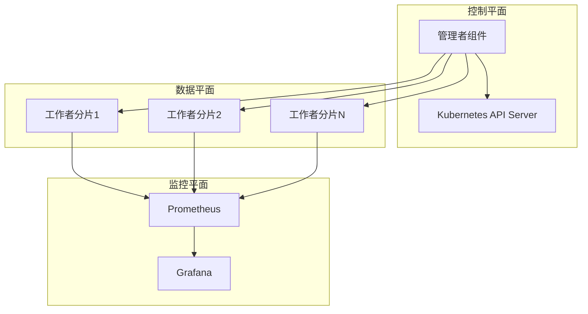
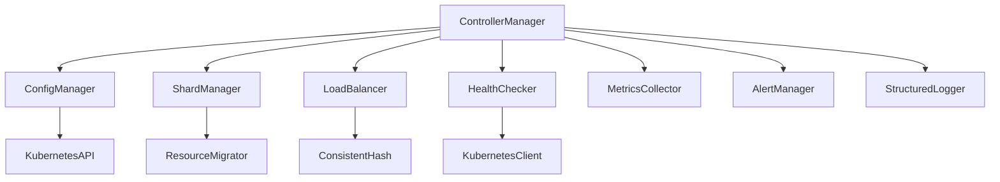

# Kubernetes 分片控制器 (Shard Controller) - 架构分析文档

## 项目概述

### 项目定位
Kubernetes 分片控制器是一个生产就绪的云原生控制器，专门为 Kubernetes 环境中的分布式工作负载提供动态分片能力。它基于 Kubernetes Operator 模式实现，通过自定义资源定义 (CRD) 和控制循环来管理分片的生命周期。

### 核心价值
- **可扩展性**: 通过动态分片创建和管理实现水平扩展
- **负载均衡**: 提供多种负载均衡策略 (一致性哈希、轮询、最少负载)
- **高可用性**: 支持领导者选举的容错部署
- **资源管理**: 自动化资源迁移和健康监控

---

## 系统架构设计

### 整体架构模式

项目采用**管理者-工作者 (Manager-Worker)** 架构模式：



### 核心组件分析

#### 1. 管理者组件 (Manager)
**文件位置**: `cmd/manager/main.go`, `pkg/controllers/manager.go`

**职责**:
- 分片生命周期管理 (创建、删除、扩缩容)
- 负载均衡决策和资源分配
- 健康检查和故障恢复
- 配置变更监听和热更新
- 指标收集和告警管理

**核心接口**:
```go
type ShardManager interface {
    CreateShard(ctx context.Context, config *shardv1.ShardConfig) (*shardv1.ShardInstance, error)
    ScaleUp(ctx context.Context, targetCount int) error
    ScaleDown(ctx context.Context, targetCount int) error
    RebalanceLoad(ctx context.Context) error
}
```

#### 2. 工作者组件 (Worker)
**文件位置**: `cmd/worker/main.go`

**职责**:
- 处理分配给当前分片的资源
- 定期向管理者报告健康状态和负载指标
- 执行资源迁移操作
- 优雅关闭和资源清理

**核心接口**:
```go
type WorkerShard interface {
    ProcessResource(ctx context.Context, resource *Resource) error
    ReportHealth(ctx context.Context) (*shardv1.HealthStatus, error)
    MigrateResourcesTo(ctx context.Context, targetShard string, resources []*Resource) error
}
```

#### 3. 自定义资源定义 (CRDs)

##### ShardConfig CRD
**文件位置**: `manifests/crds/shardconfig-crd.yaml`

定义分片配置规范:
```yaml
spec:
  minShards: 1-100          # 最小分片数
  maxShards: 1-100          # 最大分片数  
  scaleUpThreshold: 0.1-1.0 # 扩容阈值
  scaleDownThreshold: 0.1-1.0 # 缩容阈值
  healthCheckInterval: "30s"   # 健康检查间隔
  loadBalanceStrategy: "consistent-hash" # 负载均衡策略
```

##### ShardInstance CRD  
**文件位置**: `manifests/crds/shardinstance-crd.yaml`

表示单个分片实例:
```yaml
spec:
  shardId: "shard-1"        # 分片唯一标识
  hashRange:                # 哈希范围 (一致性哈希)
    start: 0
    end: 1073741823
  resources: []             # 分配的资源列表
```

---

## 设计理念深度分析

### 1. 云原生设计原则

#### Kubernetes Operator 模式
- **控制循环**: 实现持续的期望状态 vs 实际状态对比
- **声明式 API**: 用户声明期望状态，控制器负责实现
- **事件驱动**: 基于 Kubernetes 事件触发操作

#### 容器化和微服务
- **组件分离**: Manager 和 Worker 独立部署
- **无状态设计**: 状态存储在 Kubernetes etcd 中
- **健康检查**: 标准的 `/healthz` 和 `/readyz` 端点

### 2. 分片策略设计

#### 一致性哈希算法
**文件位置**: `pkg/utils/hash.go`

**核心特性**:
- **虚拟节点**: 每个物理分片对应多个虚拟节点，提高负载均衡
- **线程安全**: 使用读写锁保护哈希环操作
- **负载分布**: 计算每个节点负责的哈希空间比例

```go
type ConsistentHash struct {
    hashRing     map[uint32]string  // 哈希环
    sortedHashes []uint32           // 排序的哈希值
    replicas     int               // 虚拟节点数
    mu           sync.RWMutex      // 读写锁
}
```

#### 负载均衡策略
**支持的策略**:
1. **一致性哈希** (`consistent-hash`): 适用于缓存场景
2. **轮询** (`round-robin`): 简单均匀分布
3. **最少负载** (`least-loaded`): 基于实时负载动态分配

### 3. 可观测性设计

#### 指标体系
**接口定义**: `pkg/interfaces/interfaces.go`

```go
type MetricsCollector interface {
    RecordMigration(sourceShard, targetShard, status string, duration time.Duration)
    RecordScaleOperation(operation, status string)  
    RecordError(component, errorType string)
    UpdateQueueLength(queueType, shardID string, length int)
}
```

#### 结构化日志
**事件类型**:
- 分片事件 (`LogShardEvent`)
- 迁移事件 (`LogMigrationEvent`) 
- 扩缩容事件 (`LogScaleEvent`)
- 健康检查事件 (`LogHealthEvent`)

#### 告警系统
**告警类型**:
- 分片故障告警 (`AlertShardFailure`)
- 高错误率告警 (`AlertHighErrorRate`)
- 系统过载告警 (`AlertSystemOverload`)

---

## 技术关系深度解析

### 1. 组件依赖关系



### 2. 接口抽象设计

#### 核心接口分层
**文件位置**: `pkg/interfaces/interfaces.go`

**第一层 - 业务逻辑接口**:
- `ShardManager`: 分片管理
- `WorkerShard`: 工作者分片
- `LoadBalancer`: 负载均衡

**第二层 - 基础服务接口**:  
- `HealthChecker`: 健康检查
- `ResourceMigrator`: 资源迁移
- `ConfigManager`: 配置管理

**第三层 - 支撑服务接口**:
- `MetricsCollector`: 指标收集
- `AlertManager`: 告警管理  
- `StructuredLogger`: 结构化日志

### 3. 数据流向分析

#### 控制流
```
用户创建 ShardConfig → Manager 监听 → 创建 ShardInstance → 部署 Worker Pod
```

#### 数据流  
```
Resource → LoadBalancer 选择分片 → Worker 处理 → 状态更新 → Manager 监控
```

#### 监控流
```
Worker 指标 → Prometheus 收集 → Grafana 展示 → AlertManager 告警
```

---

## 配置管理体系

### 1. 配置层次结构
**文件位置**: `pkg/config/config.go`

```go
type Config struct {
    // Kubernetes 配置
    KubeConfig string
    MasterURL  string  
    Namespace  string
    
    // 控制器配置
    LeaderElection LeaderElectionConfig
    HealthCheck    HealthCheckConfig
    Metrics        MetricsConfig
    Alerting       AlertingConfig
    
    // 默认分片配置
    DefaultShardConfig ShardConfig
}
```

### 2. 配置验证机制
**验证规则**:
- `minShards > 0`
- `maxShards >= minShards`  
- `0 < scaleUpThreshold <= 1`
- `0 < scaleDownThreshold < scaleUpThreshold`

### 3. 热更新机制
**实现方式**:
- 监听 ConfigMap 变更事件
- 配置校验通过后动态应用
- 配置变更日志记录

---

## 部署和运维架构

### 1. 容器化架构
**Docker 镜像**:
- `shard-controller/manager:latest`: 管理者组件镜像
- `shard-controller/worker:latest`: 工作者组件镜像

**多阶段构建**:
```dockerfile  
# 构建阶段
FROM golang:1.24-alpine AS builder
# 运行阶段
FROM alpine:latest
```

### 2. Kubernetes 部署清单

#### RBAC 权限
**文件位置**: `manifests/rbac.yaml`
- 管理 CRDs 的权限
- Pod 和 Service 的操作权限
- ConfigMap 和 Secret 的读取权限

#### 高可用部署
**特性**:
- 领导者选举防止脑裂
- Pod 反亲和性确保分布部署
- 滚动更新策略保证可用性

#### 监控集成
**Prometheus 配置**:
```yaml
scrape_configs:
- job_name: 'shard-manager'
  static_configs:
  - targets: ['shard-manager:8080']
- job_name: 'shard-worker'  
  static_configs:
  - targets: ['shard-worker:8080']
```

### 3. Helm Chart 支持
**文件位置**: `helm/shard-controller/`
- 参数化配置
- 多环境支持
- 依赖管理

---

## 扩展性和未来规划

### 1. 当前架构的扩展点
- **负载均衡策略**: 支持自定义策略算法
- **资源类型**: 支持多种资源类型处理
- **监控指标**: 可扩展的指标收集框架
- **告警渠道**: 支持多种告警通知方式

### 2. 技术债务和改进方向
- **多集群支持**: 跨集群分片管理
- **服务网格集成**: 与 Istio/Linkerd 集成
- **高级调度策略**: 基于机器学习的智能调度
- **安全增强**: 更细粒度的权限控制

### 3. 性能优化策略
- **批处理操作**: 减少 API 调用频次
- **缓存机制**: 本地状态缓存
- **连接池**: 复用 Kubernetes 客户端连接
- **异步处理**: 非阻塞的事件处理

---

## 测试和质量保证

### 1. 测试体系
**文件位置**: `test/`

**测试类型**:
- **单元测试**: `pkg/*_test.go` - 组件级测试
- **集成测试**: `test/integration/` - 系统级测试  
- **性能测试**: `test/performance/` - 负载和压力测试
- **端到端测试**: 完整场景验证

### 2. 质量指标
- **代码覆盖率**: 目标 >80%
- **性能基准**: 支持数千分片，亚秒级协调
- **可靠性**: 99.9% 可用性目标
- **安全扫描**: 自动化漏洞检测

---

## 总结

Kubernetes 分片控制器是一个设计良好的云原生分布式系统，它遵循了现代软件架构的最佳实践：

### 架构优势
1. **模块化设计**: 清晰的组件分离和接口抽象
2. **云原生**: 深度集成 Kubernetes 生态系统  
3. **可扩展性**: 支持水平扩展和垂直扩展
4. **可观测性**: 全面的监控、日志和告警
5. **生产就绪**: 完整的部署、测试和运维支持

### 技术特色
- **一致性哈希**: 高效的负载分布算法
- **Operator 模式**: 声明式 API 和控制循环
- **接口驱动**: 高度抽象的组件设计
- **事件驱动**: 响应式架构模式

### 应用场景
- **大规模分布式缓存**: Redis/Memcached 集群管理
- **数据库分片**: 数据库水平分片自动化
- **流处理系统**: 实时数据流分片处理
- **微服务负载均衡**: 服务实例动态调度

这个项目展示了如何在 Kubernetes 环境中构建一个企业级的分布式系统控制器，为云原生应用的分片管理提供了完整的解决方案。